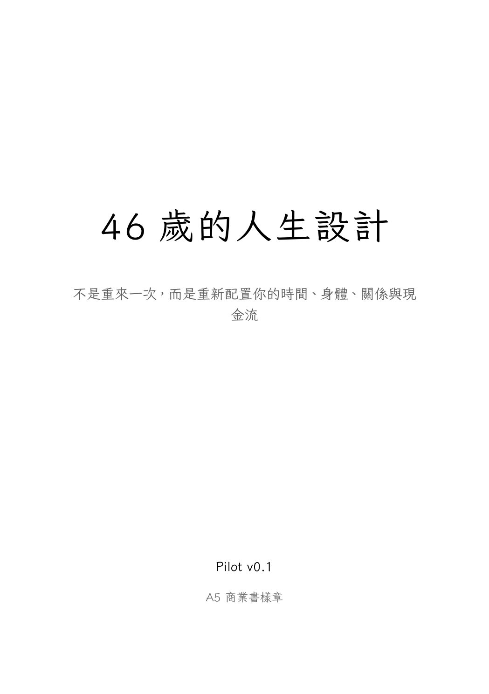

::: {.book-hero}
::: {.hero-copy}
::: {.kicker}
科學理性務實的 40+ 人生設計書
:::

# 46歲的人生設計 {.hero-title}

不是重來一次，而是重新配置你的時間、身體、關係與現金流。

::: {.hero-actions}
[開始閱讀](#前言-為什麼是-46-歲){.primary-action}
[看章節](#toc-title){.secondary-action}
:::

::: {.hero-meta}
A5 初稿 · 10 章 · 49 筆 CrossRef DOI 驗證文獻 · 芫荽體閱讀版
:::
:::

::: {.hero-cover}
{fig-alt="《46歲的人生設計》書封"}
:::
:::

::: {.reading-note}
這不是中年勵志書，而是寫給 40+ 高責任族群的人生產品經理手冊。核心主張：中年不是重新開始，而是重新配置。
:::






















